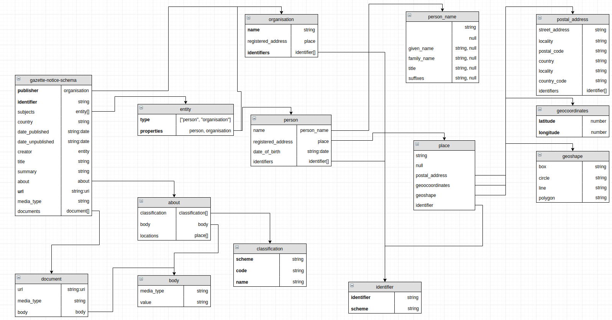

# Oznámení na úředních deskách

**Draft 2017-12-04**

## Plný model


Základ modelu je jedna zpráva na úřední desce: **[Oznámení na úřední desce](./gazette-notice-schema/)**

## Submodely
Praktická implementace může použít skoro libovolný submodel z plného modelu. Povinné jsou pouze `úřední deska`(`organizace`) a `url`.

V případě, že implementace používá prvky z plného modelu, měly by se jmenovat tak, jak jsou popsány v modelu.

V implementaci je možné použít i další vlastní prvky, které nejsou popsány v plném modelu.

## Specifikace pomocí JSON-LD
  - [Oznámení na úřadní desce](https://github.com/michalskop/data_standards/blob/master/gazette_notice/json-ld/gazetteNotice.jsonld)
  - [Úřední deska (organizace)](https://github.com/michalskop/data_standards/blob/master/gazette_notice/json-ld/gazette.jsonld)
  TBD **


## Specifikace pomocí JSON schema
JSON schema modelu (v0.4):

  - [Interaktivní dokumentace schématu](https://michalskop.github.io/docson/#https://raw.githubusercontent.com/michalskop/data_standards/master/gazette_notice/json_schema_cs/gazette-notice-schema.json)
  - [Popis na Github](https://github.com/michalskop/data_standards/tree/master/gazette_notice/json_schema_cs)

## Specifikace pomocí XSD
TBD **

## Serializace do CSV
Při použití formátu CSV se doporučuje použít [Tabular Data Resource](http://specs.frictionlessdata.io/table-schema/), popis takového souboru se doporučuje jako [Tabular Data Package](http://specs.frictionlessdata.io/table-schema/)

TBD **

## Příklady

**Oznámení na desce dle specifikace JSON-LD**
```json
{
    "@context": "https://raw.githubusercontent.com/michalskop/data_standards/master/gazette_notice/json-ld/gazetteNotice.jsonld",
    "organizace": {
        "nazev": "Moravskoslezský kraj - Krajský úřad"
    },
    "agenda": "Veřejné vyhlášky",
    "znacka": "MSK 105521/2017",
    "nazev": "Rekonstrukce betonárny Šenov",
    "anotace": "Vyhlášení dotačního programu Podpora obnovy a rozvoje venkova Moravskoslezského kraje 2018",
    "zverejneno_od": "2017-11-13",
    "zvereneno_do": "2017-11-30",
    "stav": "vyvěšeno",
    "schváleno": "2017-11-13",
    "revize": "2017-11-13T16:09:06",
    "dokument": [
        "https://www.msk.cz/eudr/Veřejné%20vyhlášky/KUMS0B3KGV2F%231/KUMS0B3KGV2F%231%23KUMS0B3KGV2F/g5260584.pdf",
        "https://www.msk.cz/assets/verejna_sprava/priloha-c--1---navrh-smlouvy-o-poskytnuti-dotace-z-rozpoctu-kraje_4.pdf"
    ]
}
```

TBD **

## Odkazy
  - [Přehled některých českých implementací](https://docs.google.com/spreadsheets/d/1x2ix9qv1DiXO26lLnvM9c7w83Wg_Wpeu8BP1OsTS1Q4/edit#gid=0)
  - [Open Corporates' Gazette Notice](https://github.com/openc/openc-schema/blob/master/schemas/gazette-notice-schema.json)
  - Diagram lze editovat na [Draw.io](https://www.draw.io) s použitím [zdrojového XML](https://raw.githubusercontent.com/michalskop/data_standards/master/gazette_notice/gazette_notice_diagram_full.xml)
  - [Mapování na existující standardy - Open Corporates](https://docs.google.com/spreadsheets/d/16hh30KrV9m6aTY5KWlG5mFqyi07cEMXlWYcWEe8GUKk/edit#gid=0)
  - [Existující standardy](http://www.popoloproject.com/appendices/survey.html)
  - [Přehled odkazů ke standardizaci](https://docs.google.com/document/d/1lejsvjTd86urF37X6H4S1OhP3zRpjuiOkz_kLQNCsTY/edit#)
